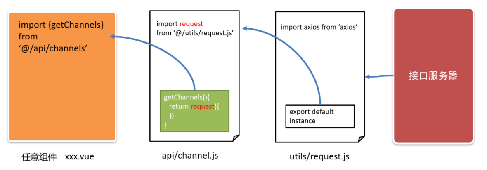
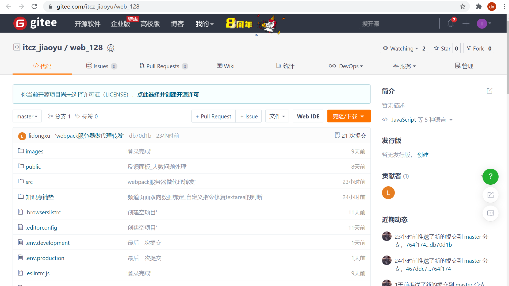
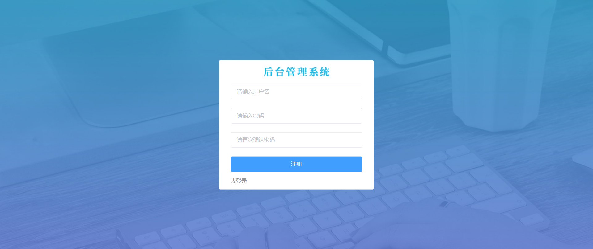
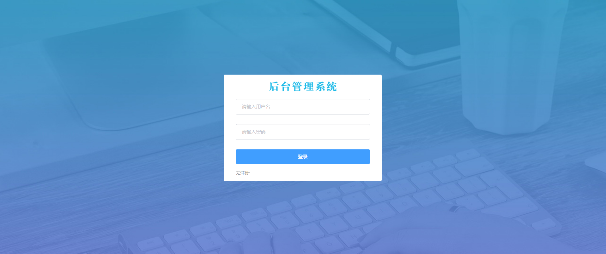

# 初始化 注册 登录

## 01 项目 简介

### 目标

- 通过学习《Vue 大事件》项目，巩固 Vue 基础中所学的知识，掌握从 0 到 1 开发企业级项目的能力。

### 讲解

#### 所需的前置知识

1. **Vue 基础**
   - vue-cli、指令、组件、vue-router 路由、vuex
2. **axios**
   - baseURL、拦截器
3. **element-ui**
   - 安装与配置、常用的组件
4. **npm 与 模块化**

- 能使用 npm 维护项目中的依赖包
- ES6 模块化语法

#### 学完本项目可以掌握的能力

1. 登录注册的业务实现流程
2. 在项目中使用 vuex 管理全局共享的数据
3. element-ui 组件在实际开发中的应用
4. 文件上传、富文本编辑器在 Vue 项目中的应用

### 小结

1. 我们为何要做这个项目?

   <details>
   <summary>答案</summary>
   <ul>
   <li>为了练习我们的Vue基础掌握的知识, 学习更多的业务和项目场景</li>
   </ul>
   </details>

## 02 项目 初始化

### 目标

- 从 0 创建 1 个 Vue 脚手架模板项目, 自带路由和 vuex 以及 eslint 等

### 讲解

1. 确认自己 vue 命令版本

   - 查看 vue 命令版本(注意: 是大 V)

     ```bash
     vue -V
     ```

   - 如果不是 5.x 版本, 可以执行命令更新

     ```bash
     npm i @vue/cli -g
     ```

2. 采用自定义预设来创建项目(或者使用你之前保存过的预设)

   - 需要 vue2 版本
   - 需要 babel
   - 需要 vue-router
   - 需要 vuex
   - 需要 eslint
   - 需要 less

3. 如果你没有保存过以上的预设, 请按照下面步骤选择, 如果有则此步骤略过

   > 选择第 3 个 自定义预设

   

   初始化 vue-cli 的核心步骤：

   1. Manually select features
      - **(\*) Babel**
      - ( ) TypeScript
      - ( ) Progressive Web App (PWA) Support
      - **(\*) Router**
      - **(\*) Vuex**
      - **(\*) CSS Pre-processors**
      - **(\*) Linter / Formatter**
      - ( ) Unit Testing
      - ( ) E2E Testing
   2. Choose a version of Vue.js that you want to start the project with (Use arrow keys)
      - **2.x**
      - 3.x
   3. Use history mode for router? (Requires proper server setup for index fallback in production) (Y/n)
      - **n**
   4. Pick a CSS pre-processor (PostCSS, Autoprefixer and CSS Modules are supported by default): (Use arrow keys)
      - Sass/SCSS (with dart-sass)
      - Sass/SCSS (with node-sass)
      - **Less**
      - Stylus
   5. Pick a linter / formatter config: (Use arrow keys)
      - ESLint + Airbnb config
      - **ESLint + Standard config**
      - ESLint + Prettier
   6. Pick additional lint features: (Press <space> to select, <a> to toggle all, <i> to invert selection)
      - **(\*) Lint on save**
      - ( ) Lint and fix on commit
   7. Where do you prefer placing config for Babel, ESLint, etc.? (Use arrow keys)
      - **In dedicated config files**
      - In package.json
   8. Save this as a preset for future projects? (y/N)
      - **N**

4. 梳理项目结构

   > 为项目开发做准备，把不需要的代码、文件删除掉

   1. 重置 `src/App.vue` 组件中的代码

      ```vue
      <template>
        <!-- 一级路由会挂载到App.vue组件 -->
        <div>App 根组件</div>
      </template>
      
      <script>
      export default {
        name: 'App',
      }
      </script>
      
      <style lang="less" scoped></style>
      ```
   
   2. 重置 `src/router/index.js` 路由模块中的代码
   
      ```js
      import Vue from 'vue'
      import VueRouter from 'vue-router'
   
      Vue.use(VueRouter)
   
      const routes = []
   
      const router = new VueRouter({
        routes,
      })
   
      export default router
      ```
   
   3. 清空 `src/components` 目录和 `src/views` 目录。
   
   4. 把**图片素材**目录下的 **images 文件夹**（项目中需要用到的图片），复制粘贴到 **src/assets** 目录下。
   
   5. 并把 global.less, 引入到 main.js
   
      ```js
      import '@/assets/global.less' // 全局初始化样式
      ```

### 小结

1. 初始化模板都有什么功能?

   <details>
   <summary>答案</summary>
   <ul>
   <li>得到一个脚手架基础环境, 有babel, vue-router和vuex, 以及支持vue语法和vue文件开发的webpack0配置环境</li>
   </ul>
   </details>

## 03 项目 ESLint 介绍

### 目标

- 了解 ESLint 的作用并能判断 ESLint 的错误

### 讲解

#### ESLint 是什么

[ESLint](http://eslint.cn/) 是一个代码检查工具，用来检查你的代码是否符合指定的规范

- 例如: = 的前后必须有一个空格
- 例如: 函数名后面必须有空格
- 例如: await 必须用用在 async 修饰的函数内
- 例如: ==必须转换成 3 个等
- ........

#### ESLint 的好处

- 在写代码过程中, 检查你代码是否错误, 给你`小黑屋`提示

- ESLint 可以约束团队内代码的风格统一

> `ESLint是法官, Standard是法律`

#### ESLint 的规范

规范文档: http://www.verydoc.net/eslint/00003312.html

规范文档 2: https://standardjs.com/rules-zhcn.html

规范文档 3: http://eslint.cn/docs/rules/

#### ESLint 使用

在代码里随便多写几个回车, ESLint 会跳出来`刀子嘴`, `豆腐心`的提示你.

在 webpack 开发服务器终端 / 浏览器 => 小黑屋


> eslint 是来帮助你的。心态要好，有错，就改。

把第 4 步规则名字, 复制到上面规范里查找违反了什么规则 / 根据第三步提示修改

### 小结

1. 什么是 ESLint?

   <details>
   <summary>答案</summary>
   <ul>
   <li>代码检查工具</li>
   </ul>
   </details>

2. 为什么要使用 ESLint?

   <details>
   <summary>答案</summary>
   <ul>
   <li>规范我们写代码的格式, 看着整洁 / 团队内成员风格统一</li>
   </ul>
   </details>

3. ESLint 在哪里生效?

   <details>
   <summary>答案</summary>
   <ul>
   <li>webpack开发服务器(终端和网页)+vscode(前提安装了eslint插件)</li>
   </ul>
   </details>

## 04 项目 ESLint 使用

### 目标

- 了解 ESLint 工作过程
- 了解 VSCode 配合 ESLint 插件, 自动修复部分代码问题

### 讲解

#### ESLint 工作过程

1. 我们 vue 初始化项目的时候, 选择需要 eslint 功能, 以及 standard 检查规则
2. 确保==vscode 根目录==有 eslintrc 配置文件, vscode 工作区(目录环境), 会根据配置来检查你的代码
3. 当前项目下, 编写的代码, 违反 eslint 规则, 会在终端报错

#### ESLint 工作环境

1. webpack+eslint 检查代码, 在终端输出检查报错结果
2. Vscode+ESLint 插件, 在编写代码区域报错结果+自动修复

#### ESLint 插件

> 使用 ESLint 插件, 填入配置, 它会根据你当前项目的 eslint 配置来帮助你自动修复一些语法代码问题

1. 在 VSCode 中, 下载这个插件

   

==2. 非常非常非常重要==

一定要把脚手架工程, 作为 vscode**根目录**, 因为 vscode+eslint 插件要使用配置文件.eslintrc, 按照这个的规则检查你的代码


3. 一定要配置插件监测的时机, 修改 ESLint 插件配置

   

   不用管别的(你的插件和我图片所示不一样, 你的可能多/少), 把红框的放在{}内即可

   ```js
   "eslint.run": "onType",
   "editor.codeActionsOnSave": {
   	"source.fixAll.eslint": true
   }
   ```

> 更多的规则可以参考这里: https://www.cnblogs.com/jiaoshou/p/12218642.html

4. 检查是否生效

   - 随便在 src 下的任意文件里多敲击几个回车, vscode 报错提示, 证明 ESLint 插件开始工作

   - ctrl + s 报错下是否能自动修复部分问题, 可以, 证明 ESLint 插件开始工作

> 如果不工作, 请按照此文件检查: https://kdocs.cn/l/crar3sGM9wFs

#### 自定义规则

在.eslintrc.js 文件中, 可以调整规则(团队内可以自定义自己一套)


rules 是一个对象，以键值对的格式来约定规则：

- 键名是规则名
- 值是这条规则的具体说明。最常见的有 off,warn,error

### 小结

1. VSCode+ESLint 插件有何作用?

   <details>
   <summary>答案</summary>
   <ul>
   <li>可以根据项目环境的eslint配置来自动修复部分代码问题</li>
   </ul>
   </details>

## 05 项目 配置组件库

### 目标

- 项目配置 element-ui 全部注册, 提高页面开发效率

### 讲解

> 参照 element-ui 的官方文档，进行安装、配置、使用：https://element.eleme.io/#/zh-CN/component/installation

1. 下载 element-ui 包到当前项目(注意它支持的是 Vue2 版本项目)

   ```bach
   yarn add element-ui
   ```

2. 封装新建`src/elementUI/index.js`, 在这里进行组件引入和注册

   ```js
   import Vue from 'vue'
   import ElementUI from 'element-ui'
   import 'element-ui/lib/theme-chalk/index.css'

   Vue.use(ElementUI)
   ```

3. 在 main.js 中引入, 使其参与到 webpack 打包并在网页生效

   ```js
   import '@/elementUI' // 注册elementUI组件
   ```

### 小结

1. 为何 elementUI 注册单独封装个模块文件?

   <details>
   <summary>答案</summary>
   <ul>
   <li>分散管理, 方便查找</li>
   </ul>
   </details>

## 06 项目 封装请求库

### 目标

- 封装项目请求架构, 为后面请求数据做准备

### 讲解

核心思想: 分层架构

- 在任意组件, 调用封装的接口方法, 接口方法调用统一的 axios 函数告诉他请求的参数, 它去请求数据

  > 我(任意组件) -> 秘书(接口函数) -> 车(axios) -> 数据(后台返回)



1. 安装 axios

   ```bash
   yarn add axios
   ```

2. 新建`src/utils/request.js`项目核心请求方法的模块文件

   ```js
   // 基于axios的二次请求模块
   
   import axios from 'axios'
   
   // 创建一个自定义的axios方法,比原axios多了个基地址
   // axios函数请求的url地址前面会被拼接基地址, 然后axios请求 baseURL + url 后台完整地址
   const myAxios = axios.create({
     baseURL: 'http://big-event-vue-api-t.itheima.net', // 基地址就是一个域名
   })
   
   // 导出自定义的axios方法, 供外面调用传参发请求
   export default myAxios
   ```

3. 新建`src/api/index.js`项目接口方法统一管理模块文件

   ```js
   import request from '@/utils/request'

   export const getListAPI = () => {
     // 这里先用这个接口测试下, 如果url以http开头会忽略baseURL, axios直接请求此地址
     return request({
       url: 'http://geek.itheima.net/v1_0/channels',
     })
   }
   ```

4. 在任意组件`src/App.vue`中, 引入接口请求方法, 并请求数据

   ```js
   import { getListAPI } from '@/api'
   export default {
     created() {
       this.getListFn()
     },
     methods: {
       async getListFn() {
         const res = await getListAPI()
         console.log(res)
       },
     },
   }
   ```

> 这种分层架构思想, 可以更好的统一管理项目中所有接口, 并也方便统一给 axios 方法添加拦截器和修改基地址

### 小结

1. 为何要把网络请求封层, 分文件模块来管理?

   <details>
   <summary>答案</summary>
   <ul>
   <li>便于管理和查找, 以及替换和修改</li>
   </ul>
   </details>

2. 网络请求, 封装了哪些东西?

   <details>
   <summary>答案</summary>
   <ul>
   <li>utils/request.js网络请求工具函数, api/index.js定义具体请求的接口方法和传参, 在任意组件调用接口方法请求拿到数据</li>
   </ul>
   </details>

## 07 项目 git 使用

### 目标

- 把自己项目, 用 git 版本控制系统管理, 并远程托管保存在 gitee 网站

### 讲解

#### 新项目-本地仓库

1. 创建脚手架项目后, 再项目目录下, 使用如下命令, 初始化本地 git 仓库

   > 标志: 有个.git 隐藏的文件夹, 它保存 git 相关一切, 并且它所在的本地文件夹就是 git 仓库,

   ```bash
   git init
   ```

2. 把刚新建的并配置好的代码, 可以暂存, 本地提交一次, 产生一次提交记录, 让 git 快照记录一次

   ```bash
   # 暂存当前目录下所有变化的文件, 到内存
   git add .
   # 本地提交, 才真的被git记录了一次快照在磁盘
   git commit -m '项目模板, 自定义初始化完成'
   ```

#### 新项目-远程仓库

1. 目的: 代码保存到远程

   - gitee.com 网站注册账号并且登录
   - gitee.com 网站创建仓库

   

2. 根据网站的命令操作(已有本地仓库)

   > 只有第一次需要 -u origin master, 以后直接 git push

   ```bash
   git remote add origin 远程仓库地址(自己去网页看)
   git push -u origin master
   ```

3. 上传成功可以看到这里

   > 如果公司自己 git 服务器, 没有网页, 需要 git log 看提交记录



#### 新旧项目 以后提交和推送

> 本地开发代码, 变化后

- 先本地提交保存(暂不保存到远程仓库上)

  ```js
  git add .
  git commit -m '提交说明,一定要写清楚,方便以后回滚'
  ```

- 要推送到远程的话才执行这句

  > 因为本地仓库和远程仓库, 已经建立好链接前面, 所以直接推送即可

  ```js
  git push
  ```

#### 项目 克隆或拉取

> 如果刚进公司, 本地没有 git 仓库和代码, 需要的是克隆

- 第一次克隆下来

  - 注意: http/https 开头的地址, 需要账号密码才能克隆/推送
  - 注意; git@开头的地址, 需要 ssh 秘钥文件配置好, 才能免账号密码克隆/推送

  ```js
  git clone 远程git仓库地址
  ```

- 多人协同开发一个项目, 别人推送了, 以后直接拉取更新即可

  > 如果提示有冲突, 打开代码, 找到对方商量合并冲突
  >
  > 前提: 你本地有变化必须暂存提交后, 才能拉取!!!

  ```js
  git pull
  ```

### 小结

1. git 有什么作用?

   <details>
   <summary>答案</summary>
   <ul>
   <li>可以管理代码的版本(没提交一个功能可以有个记录, 随时可以回退)</li>
   </ul>
   </details>

2. 本地仓库和远程仓库区别?

   <details>
   <summary>答案</summary>
   <ul>
   <li>本地仓库在每个成员电脑本地, 而远程仓库一般在服务器上, 远程仓库类似网盘专门存储git版本提交记录和代码</li>
   </ul>
   </details>

## 08 项目 注册和登录 页面准备

### 目标

- 准备注册和登录页面组件及路由

### 讲解

1. 新建注册页面组件, 在`src/views/register/index.vue`, 直接复制标签

   ```vue
   <template>
     <div>Reg.vue</div>
   </template>

   <script>
   export default {
     name: 'my-register',
   }
   </script>

   <style lang="less" scoped></style>
   ```

2. 新建登录页面组件, 在`src/views/login/index.vue`, 直接复制标签

   ```vue
   <template>
     <div>Login.vue</div>
   </template>

   <script>
   export default {
     name: 'my-login',
   }
   </script>

   <style lang="less" scoped></style>
   ```

3. 在`src/router/index.js`配置路由表

   ```js
   import Vue from 'vue'
   import VueRouter from 'vue-router'

   Vue.use(VueRouter)

   const routes = [
     {
       path: '/reg',
       component: () => import('@/views/register'),
     },
     {
       path: '/login',
       component: () => import('@/views/login'),
     },
   ]

   const router = new VueRouter({
     routes,
   })

   export default router
   ```

4. 在 `App.vue` 组件中，定义 `<router-view>` 如下

   > 可以把之前测试的代码直接覆盖掉

   ```vue
   <template>
     <router-view></router-view>
   </template>

   <script>
   export default {
     name: 'App',
   }
   </script>

   <style lang="less" scoped></style>
   ```

5. 启动 webpack 开发服务器, 然后在页面的地址栏, 手动切换路由地址看是否配置成功

### 小结

1. 路由表是什么?

   <details>
   <summary>答案</summary>
   <ul>
   <li>指的路由规则对象的数组, 路由对象是路径和组件的映射关系</li>
   </ul>
   </details>

## 09 注册 标签布局和表单校验

### 目标

- 完成注册页面, 标签和样式布局



### 讲解

1. 在`src/views/register/index.vue`, 初始化注册页面的基础布局，并美化样式, ==先看需求图, 分析后直接复制后阅读==

   ```vue
   <template>
     <!-- 注册页面的整体盒子 -->
     <div class="reg-container">
       <!-- 注册的盒子 -->
       <div class="reg-box">
         <!-- 标题的盒子 -->
         <div class="title-box"></div>
         <!-- 注册的表单区域 -->
       </div>
     </div>
   </template>

   <script>
   export default {
     name: 'my-register',
   }
   </script>

   <style lang="less" scoped>
   .reg-container {
     background: url('../../assets/images/login_bg.jpg') center;
     background-size: cover;
     height: 100%;

     .reg-box {
       width: 400px;
       height: 335px;
       background-color: #fff;
       border-radius: 3px;
       position: absolute;
       left: 50%;
       top: 50%;
       transform: translate(-50%, -50%);
       padding: 0 30px;
       box-sizing: border-box;

       .title-box {
         height: 60px;
         background: url('../../assets/images/login_title.png') center no-repeat;
       }

       .btn-reg {
         width: 100%;
       }
     }
   }
   </style>
   ```

2. 查找 elementUI 组件库, 要完成表单组件布局, 并带上基础校验, ==自己分析铺设, 变量可以看, 不可以复制==

   - 规则 1: 用户名必须是 1-10 的大小写字母数字
   - 规则 2: 密码必须是 6-15 的非空字符
   - 规则 3: 确认密码必须和密码值一致

   ```vue
   <!-- 注册的表单区域 -->
   <el-form :model="regForm" :rules="regRules" ref="regRef">
     <!-- 用户名 -->
     <el-form-item prop="username">
       <el-input v-model="regForm.username" placeholder="请输入用户名"></el-input>
     </el-form-item>
     <!-- 密码 -->
     <el-form-item prop="password">
       <el-input v-model="regForm.password" type="password" placeholder="请输入密码"></el-input>
     </el-form-item>
     <!-- 确认密码 -->
     <el-form-item prop="repassword">
       <el-input v-model="regForm.repassword" type="password" placeholder="请再次确认密码"></el-input>
     </el-form-item>
     <el-form-item>
       <el-button type="primary" class="btn-reg">注册</el-button>
       <el-link type="info">去登录</el-link>
     </el-form-item>
   </el-form>
   
   <script>
   export default {
     name: 'my-register',
     data() {
       const samePwd = (rule, value, callback) => {
         if (value !== this.regForm.password) {
           // 如果验证失败，则调用 回调函数时，指定一个 Error 对象。
           callback(new Error('两次输入的密码不一致!'))
         } else {
           // 如果验证成功，则直接调用 callback 回调函数即可。
           callback()
         }
       }
       return {
         // 注册表单的数据对象
         regForm: {
           username: '',
           password: '',
           repassword: '',
         },
         // 注册表单的验证规则对象
         regRules: {
           username: [
             { required: true, message: '请输入用户名', trigger: 'blur' },
             {
               pattern: /^[a-zA-Z0-9]{1,10}$/,
               message: '用户名必须是1-10的大小写字母数字',
               trigger: 'blur',
             },
           ],
           password: [
             { required: true, message: '请输入密码', trigger: 'blur' },
             {
               pattern: /^\S{6,15}$/,
               message: '密码必须是6-15的非空字符',
               trigger: 'blur',
             },
           ],
           repassword: [
             { required: true, message: '请再次输入密码', trigger: 'blur' },
             { pattern: /^\S{6,15}$/, message: '密码必须是6-15的非空字符', trigger: 'blur' },
             { validator: samePwd, trigger: 'blur' },
           ],
         },
       }
     },
   }
   </script>
   ```

### 小结

1. 写任何需求的套路是什么?

   <details>
   <summary>答案</summary>
   <ul>
   <li>先准备标签和样式, 然后准备数据/变量绑定/校验规则设置</li>
   </ul>
   </details>

## 10 注册 功能实现

### 目标

- 完成点击注册按钮校验和注册功能

### 讲解

核心思想: 注册就是把用户输入的账号和密码做好校验以后, 收集到变量中, 再调用接口发给后台, 后台代码把他们存储到数据库中, 再给前端返回提示

1. 注册按钮, 绑定点击事件

   ```vue
   <el-button type="primary" class="btn-reg" @click="regNewUserFn">注册</el-button>
   ```

2. 在事件处理函数中, 先执行表单校验

   ```js
   methods: {
       // 注册新用户
       regNewUserFn () {
         // 进行表单预验证
         this.$refs.regRef.validate(valid => {
           if (!valid) return false
           // 尝试拿到用户输入的内容
           console.log(this.regForm)
         })
       }
     }
   ```

3. 前端准备好了, 准备调用后台接口了, 所以准备接口方法, 在`src/api/index.js`定义

   ```js
   /**
    * 注册接口
    * @param {*} param0 { username: 用户名, password: 密码 }
    * @returns Promise对象
    */
   
   // 导出接口方法，为了在逻辑页面引入后调用
   export const registerAPI = ({ username, password, repassword }) => {
     return request({
       url: '/api/reg',
       method: 'post',
       data: {
         username,
         password,
         repassword,
       },
     })
   }
   ```

4. 在逻辑页面引用接口, 并在注册逻辑中调用, 并使用 element 绑定在 Vue 全局属性上的$message 弹窗方法

   ```js
   // 注册新用户
   regNewUserFn () {
     // 进行表单预验证
     this.$refs.regRef.validate(async valid => {
         if (!valid) return false
         // 尝试拿到用户输入的内容
         // console.log(this.regForm)
         // 1. 调用注册接口
         const { data: res } = await registerAPI(this.regForm)
         console.log(res)
         // 2. 注册失败，提示用户
         if (res.code !== 0) return this.$message.error(res.message)
         // 3. 注册成功，提示用户
         this.$message.success(res.message)
         // 4. 跳转到登录页面
         this.$router.push('/login')
     })
   }
   ```

### 小结

1. 注册的业务逻辑是什么?

   <details>
   <summary>答案</summary>
   <ul>
   <li>把前端标签准备好, 数据绑定好, 在点击事件中走完表单验证逻辑, 调用接口传参给后台, 根据后台返回的code做前端页面结果提示</li>
   </ul>
   </details>

## 11 登录 标签布局和表单校验

### 目标

在 login 页面根据需求准备页面标签和样式



### 讲解

1. 和注册页面差不多, 标签和校验一样, 在`src/views/login/index.vue`中, 复制如下标签并阅读核对

   ```vue
   <template>
     <!-- 登录页面的整体盒子 -->
     <div class="login-container">
       <!-- 登录的盒子 -->
       <div class="login-box">
         <!-- 标题的盒子 -->
         <div class="title-box"></div>
         <!-- 登录的表单区域 -->
         <el-form :model="loginForm" :rules="loginRules" ref="loginRef">
           <!-- 用户名 -->
           <el-form-item prop="username">
             <el-input v-model="loginForm.username" placeholder="请输入用户名" maxlength="10" minlength="1"></el-input>
           </el-form-item>
           <!-- 密码 -->
           <el-form-item prop="password">
             <el-input v-model="loginForm.password" type="password" placeholder="请输入密码" maxlength="15" minlength="6">
             </el-input>
           </el-form-item>
           <el-form-item>
             <el-button type="primary" class="btn-login">登录</el-button>
             <el-link type="info">去注册</el-link>
           </el-form-item>
         </el-form>
       </div>
     </div>
   </template>
   
   <script>
   export default {
     name: 'my-login',
     data() {
       return {
         // 登录表单的数据对象
         loginForm: {
           username: '',
           password: '',
         },
         // 登录表单的验证规则对象
         loginRules: {
           username: [
             { required: true, message: '请输入用户名', trigger: 'blur' },
             { pattern: /^[a-zA-Z0-9]{1,10}$/, message: '用户名必须是1-10的字母数字', trigger: 'blur' },
           ],
           password: [
             { required: true, message: '请输入密码', trigger: 'blur' },
             { pattern: /^\S{6,15}$/, message: '密码必须是6-15的非空字符', trigger: 'blur' },
           ],
         },
       }
     },
   }
   </script>
   
   <style lang="less" scoped>
   .login-container {
     background: url('../../assets/images/login_bg.jpg') center;
     background-size: cover;
     height: 100%;
   
     .login-box {
       width: 400px;
       height: 270px;
       background-color: #fff;
       border-radius: 3px;
       position: absolute;
       left: 50%;
       top: 50%;
       transform: translate(-50%, -50%);
       padding: 0 30px;
       box-sizing: border-box;
   
       .title-box {
         height: 60px;
         background: url('../../assets/images/login_title.png') center no-repeat;
       }
   
       .btn-login {
         width: 100%;
       }
     }
   }
   </style>
   ```

2. 实现注册页面, 点击去登录跳转效果, 在`src/views/register/index.vue`中, 找到对应标签绑定点击事件跳转路由页面

   ```vue
   <el-link type="info" @click="$router.push('/login')">去登录</el-link>
   ```

3. 实现登录页面, 点击去注册跳转效果, 在`src/views/login/index.vue`中, 找到对应标签点击中跳转路由

   ```vue
   <el-link type="info" @click="$router.push('/reg')">去注册</el-link>
   ```

### 小结

1. 登录和注册如何做的, 核心思想?

   <details>
   <summary>答案</summary>
   <ul>
   <li>用的是2个页面, 做的切换, 其实也可以做标签的显示隐藏, 都能实现</li>
   </ul>
   </details>

## 12 登录 功能实现

### 目标

点击登录按钮, 实现登录逻辑

### 讲解

核心思想: 通过表单校验, 收集用户输入内容, 调用接口带给后台验证, 返回响应结果, 前端给用户提示结果

1. 为登录按钮绑定点击事件处理函数如下

   ```vue
   <el-button type="primary" class="btn-login" @click="loginFn">登录</el-button>
   ```

2. 先封装要调用的登录接口, 在`src/api/index.js`中

   ```js
   /**
    * 登录接口
    * @param {*} param0 { username: 用户名, password: 密码 }
    * @returns Promise对象
    */
   export const loginAPI = ({ username, password }) => {
     return request({
       url: '/api/login',
       method: 'post',
       data: {
         username,
         password,
       },
     })
   }
   ```

3. 在`src/view/login/index.vue`登录页面, 引入接口方法并, 实现对应事件处理函数逻辑, 校验和调用接口

   ```js
   methods: {
     // 登录按钮->点击事件
     async loginFn () {
       this.$refs.loginRef.validate(async valid => {
         if (!valid) return
         // 1. 发起登录的请求
         const { data: res } = await loginAPI(this.loginForm)
         // 2. 登录失败
         if (res.code !== 0) return this.$message.error(res.message)
         // 3. 登录成功
         this.$message.success(res.message)
       })
     }
   }
   ```

### 小结

1. 登录的逻辑是什么?

   <details>
   <summary>答案</summary>
   <ul>
   <li>把前端标签准备好, 数据绑定好, 在点击事件中走完表单验证逻辑, 调用接口传参给后台, 根据后台返回的code做前端页面结果提示</li>
   </ul>
   </details>

## 13 登录 结果存入 vuex 中

### 目标

把登录成功, 后台返回的 token 字符串存到 vuex 中

### 讲解

1. 在`src/store/index.js`中定义, state 里的 token 变量, 以及更新 token 的 `updateToken` mutation 函数

   ```js
   export default new Vuex.Store({
     state: {
       // 1. 用来存储登录成功之后，得到的 token
       token: '',
     },
     mutations: {
       // 2. 更新 token 的 mutation 函数
       updateToken(state, newToken) {
         state.token = newToken
       },
     },
   })
   ```

2. 在`src/views/login/index.vue`中, 在成功后, 调用 vuex 里的 mutations 方法

   > 可以直接调用 / 映射调用

   ```js
   import { mapMutations } from 'vuex'
   export default {
     // ...其他
     methods: {
       ...mapMutations(['updateToken']),
       // 登录按钮->点击事件
       async loginFn() {
         this.$refs.loginRef.validate(async valid => {
           if (!valid) return
           // 1. 发起登录的请求
           const { data: res } = await loginAPI(this.loginForm)
           // 2. 登录失败
           if (res.code !== 0) return this.$message.error(res.message)
           // 3. 登录成功
           this.$message.success(res.message)
           // 4. 保存到vuex中
           this.updateToken(res.token)
         })
       },
     },
   }
   ```

### 小结

1. 登录后获取 token, 保存 vuex 的代码执行思路是?

   <details>
   <summary>答案</summary>
   <ul>
   <li>在登录接口返回响应成功后, 提取后台返回的token字符串, 调用mutations方法, 把值暂存到vuex的state内变量上, 但是仅仅在内存中, 刷新后state里token变量会变成空字符串(又相当于没登录一样)</li>
   </ul>
   </details>

## 14 登录 持久化存储 vuex

### 目标

刷新 vuex 的值会回归初始化, 如果在保存到 vuex 时, 它能自动保存到浏览器本地, 默认从浏览器本地取呢?

### 讲解

> 自己写 localStorage.setItem 等 需要一个个写, 很麻烦

这里介绍一个 vuex 的插件包叫做`vuex-persistedstate@3.2.1`版本(配合 vue2 使用, 默认最新版是配合 vue3 使用)

1. 下载此包到当前工程中

   ```bash
   yarn add vuex-persistedstate@3.2.1
   ```

2. 在`src/store/index.js`中, 导入并配置

   ```js
   import Vue from 'vue'
   import Vuex from 'vuex'
   import createPersistedState from 'vuex-persistedstate'

   Vue.use(Vuex)

   export default new Vuex.Store({
     state: {
       // 1. 用来存储登录成功之后，得到的 token
       token: '',
     },
     mutations: {
       // 2. 更新 token 的 mutation 函数
       updateToken(state, newToken) {
         state.token = newToken
       },
     },
     // 配置为 vuex 的插件
     plugins: [createPersistedState()],
   })
   ```

3. 这次再来重新登录, 查看浏览器调试工具 vuex 和浏览器本地存储位置, 是否自动同步进入

4. 刷新网页看调试工具里 vuex 的默认值确实从本地取出了默认值, 保证了 vuex 的持久化

### 小结

1. vuex 为何要做持久化?

   <details>
   <summary>答案</summary>
   <ul>
   <li>vuex运行时的值保存在内存里, 如果刷新vuex的变量会变成初始化的,所以让他的默认初始化的值从本地取, 当有人赋值给vuex也同步覆盖式保存到本地一份</li>
   </ul>
   </details>

## 15 登录 跳转布局页

### 目标

完成主页的标签和样式以及路由, 然后登录成功跳转

### 讲解

1. 新建页面组件`src/views/layout/index.vue`, layout 布局页面(它右下角包含的是主页), 直接根据需求画面, ==直接复制标签和样式==

   ```vue
   <template>
     <el-container class="main-container">
       <!-- 头部区域 -->
       <el-header>
         <!-- 左侧的 logo -->
         
         <!-- 右侧的菜单 -->
         <el-menu 
               class="el-menu-top" 
               mode="horizontal" 
               background-color="#23262E" 
               text-color="#fff" 
               active-text-color="#409EFF">
           <el-submenu index="1">
             <template slot="title">
               <!-- 头像 -->
               
               <span>个人中心</span>
             </template>
             <el-menu-item index="1-1"><i class="el-icon-s-operation"></i>基本资料</el-menu-item>
             <el-menu-item index="1-2"><i class="el-icon-camera"></i>更换头像</el-menu-item>
             <el-menu-item index="1-3"><i class="el-icon-key"></i>重置密码</el-menu-item>
           </el-submenu>
           <el-menu-item index="2"><i class="el-icon-switch-button"></i>退出</el-menu-item>
         </el-menu>
       </el-header>
       <el-container>
         <!-- 侧边栏区域 -->
         <el-aside width="200px">Aside</el-aside>
         <el-container>
           <!-- 页面主体区域 -->
           <el-main> Main.vue后台主页 </el-main>
           <!-- 底部 footer 区域 -->
           <el-footer>© www.itheima.com - 黑马程序员</el-footer>
         </el-container>
       </el-container>
     </el-container>
   </template>
   
   <script>
   export default {
     name: 'my-layout',
   }
   </script>
   
   <style lang="less" scoped>
   .main-container {
     height: 100%;
     .el-header,
     .el-aside {
       background-color: #23262e;
     }
     .el-header {
       padding: 0;
       display: flex;
       justify-content: space-between;
     }
     .el-main {
       overflow-y: scroll;
       height: 0;
       background-color: #f2f2f2;
     }
     .el-footer {
       background-color: #eee;
       font-size: 12px;
       display: flex;
       justify-content: center;
       align-items: center;
     }
   }
   
   .avatar {
     border-radius: 50%;
     width: 35px;
     height: 35px;
     background-color: #fff;
     margin-right: 10px;
     object-fit: cover;
   }
   </style>
   ```

2. 在`src/router/index.js`路由中配置规则和组件

   ```js
   {
     path: '/',
     component: () => import('@/views/layout')
   }
   ```

3. 在`src/views/login/index.vue`登录页面, 登录成功后跳转到主页

   ```js
   // 登录成功之后，跳转到后台主页
   this.$router.push('/')
   ```

### 小结

1. layout 布局页面是什么作用?

   <details>
   <summary>答案</summary>
   <ul>
   <li>如果发现主页有固定的部分, 比如固定左侧导航/固定头部导航/固定底部导航, 那么这个标签放在layout, 在这个layout页面切换的部分就是嵌套的下级路由</li>
   </ul>
   </details>

## 16 退出登录

### 目标

完成退出登录的功能, 和业务学习

### 讲解

核心思想: 退出登录就是清除 vuex 和本地所有缓存的值, 然后页面强制切换到登录页面

1. 退出登录按钮, 点击事件绑定

   ```vue
   <el-menu-item index="2" @click="logoutFn"><i class="el-icon-switch-button"></i>退出</el-menu-item>
   ```

2. 实现对应事件处理函数和提示

   ```js
   methods: {
     logoutFn () {
       // 询问用户是否退出登录
       this.$confirm('您确认退出登录吗？', '提示', {
         confirmButtonText: '确定',
         cancelButtonText: '取消',
         type: 'warning'
       })
         .then(() => {
           // TODO：执行退出登录的操作
         })
         .catch((err) => err)
     }
   }
   ```

3. 执行退出逻辑代码

   ```js
   .then(() => {
       // TODO：执行退出登录的操作
       // 1. 清空 token
       this.$store.commit('updateToken', '')
       // 2. 跳转到登录页面
       this.$router.push('/login')
   })
   ```

### 小结

1. 退出登录的业务逻辑是什么?

   <details>
   <summary>答案</summary>
   <ul>
   <li>就是把vuex和本地的值清空, 然后页面强制跳转到登录页面</li>
   </ul>
   </details>

2. 为何退出登录不用调用后台接口?

   <details>
   <summary>答案</summary>
   <ul>
   <li>因为我们采用的是前端存储token来表名用户登录的身份, 没有做单点登录(就是多个设备只能保证1个设备登录状态), 所以后端无需记录登录状态所以无接口调用</li>
   </ul>
   </details>

